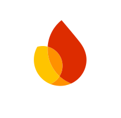

# *Hi there 👋*

## I'm Joyatu Barua, a cross-platform application developer based in Bangladesh.

### I design, build and ship safe and scalable cross-platform applications.

### I Love to code in:  

  

### Favourite Tools:

