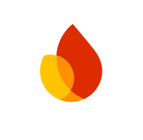

## 
*Hi there 👋 I'm Joyatu Barua* 

## 
  

👨🏻‍💻 A software engineer with a passion for problem solving inspired to create digital solutions that matter.

⚒️ I design, build and ship safe and scalable cross-platform applications using Flutter with clean architecture, efficient state management, backend integration and with scalability in mind.

🤝🏻 Open to collaborate on open-source projects

📄 Know more about me: https://www.linkedin.com/in/joyatu-barua/

 

### 🧠 Currently learning:  
#### - Linux CLI | GraphQL | Riverpod | Supabase | On-device AI

### ✨ Other interests:  
####  - AI | IoT | Robotics | Embedded Systems
 
<!-- 
| <h5>Linux CLI</h3> | <h5>GraphQL</h3> | <h5>Provider</h3> |
| :--- | :--- | :--- |
-->

### Love to code in:  

  

### Favourite Tools:

### Connect with me:

 
 
